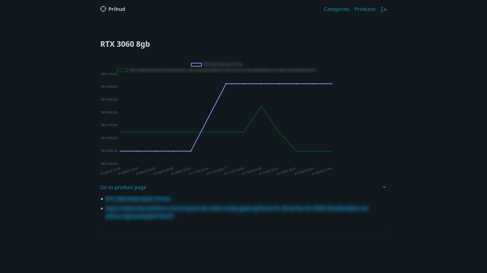
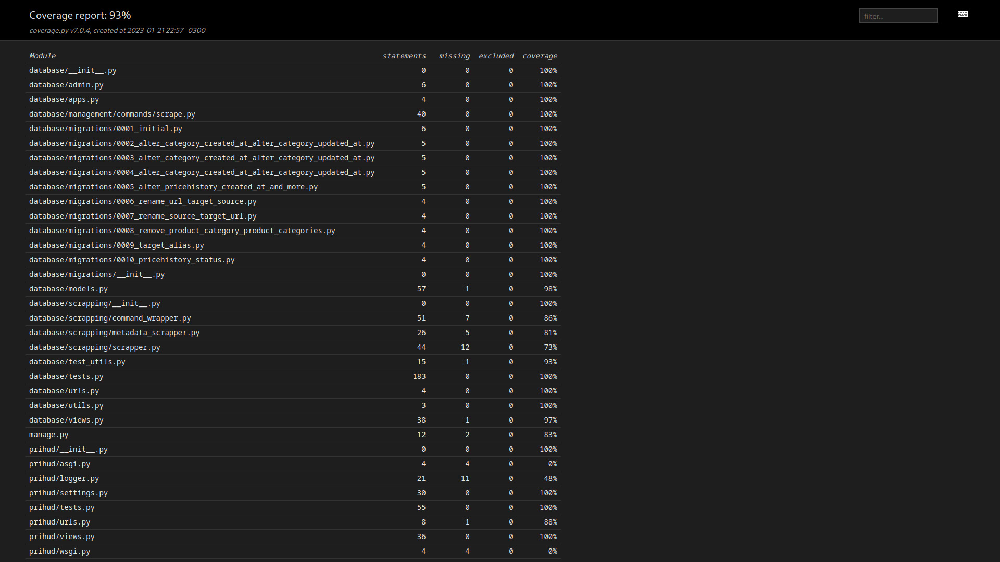

# Prihud - Price Hunter Drone
## About
Prihud is a system that helps you track and organize the price history of products sold online, by providing it with a target url, a selector for the price and the type of selector (xpath, css, tag name and class name), it will scrape the target url, search and register it's price, it can also infer throught metadata if the product is in stock or not.
### But i already know of "company X" that provides this kind of service for free!
While it is true that many companies that provide price tracking exist today, pretty much all of them use proprietary and closed source systems, that means that the end user will never be 100% sure that their information is unbiased. Prihud is licensed under GNU GPL v3, which ensures that it is, and will continue to be, libre software, respecting the end user's freedom, and offering unbiased information, on top of that, if something breaks, the end user can fix it by themselves, since they have access to the source code. 

## Launching the project
1. Clone this repository
2. `cd prihud`
3. Create a new file name `.env` (you can use `.env.template` as a reference) and fill out all variables 

Depending on how you want to run the project, you will need to run different commands, the most simple and straight forward way is to do it via docker and docker-compose, which should be installed first, just run the command `make dbu-dev`, once the command finishes, prihud should be available on `http://localhost:80`. The other methods are as follows:

### Django dev server
1. `python -m venv venv` (be sure both python and pip ar installed already)
2. `. venv/bin/activate`
3. `make dev-run`
4. Project should be available on `http://localhost:8000` 

### Gunicorn dev server
1. `python -m venv venv` (be sure both python and pip ar installed already)
2. `. venv/bin/activate`
3. `make dev-serve`
4. Project should be available on `http://localhost:8000` 

### Dockerized dev server
1. `make dev-docker-run` 
4. Project should be available on `http://localhost:80` 

Note: Avoid using `make prod-docker-run` and `make dbu-prod`, these commands are to be using during actual deployment of the project and should fail when used in a development context.  

## Running unit tests
1. `python -m venv venv` (be sure both python and pip ar installed already)
2. `. venv/bin/activate`
3. `make test`

Note: Code coverage reports are generated in html format and should be available ina folder named `htmlcov`

